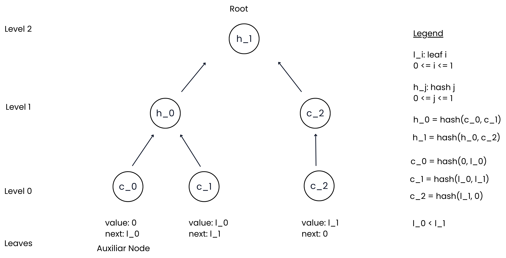
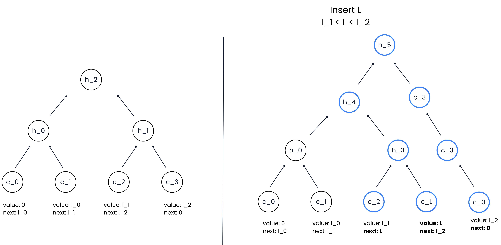
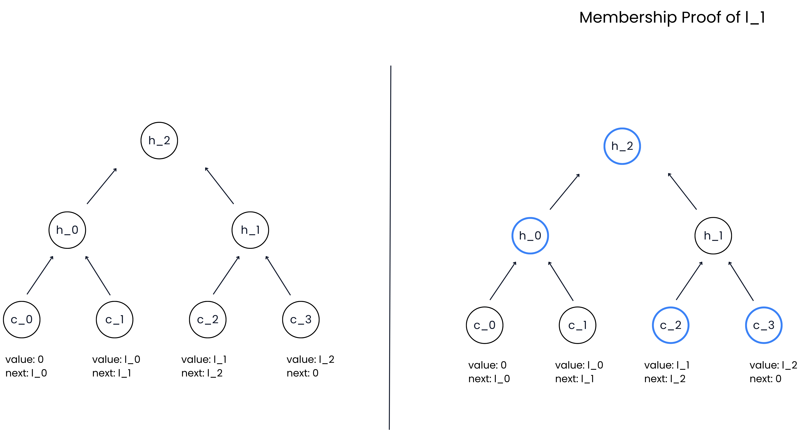
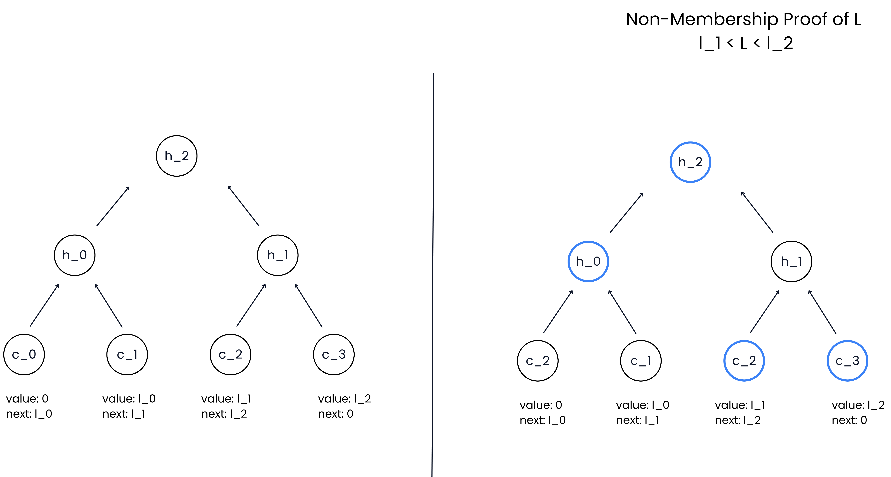

# SortedIMT

## Team
- Vivian Plasencia

## Problem

Many systems rely on Merkle Trees to prove that a value exists inside a dataset. These structures provide efficient membership proofs, but they do not natively support non-membership proofs.

This limitation affects many applications such as:

- allowlists and denylists

- nullifier sets in zero knowledge systems

- credential revocation lists

- identity systems

LeanIMT is currently the most efficient data structures for generating membership proofs with incremental updates. However, there is no widely adopted structure that provides similar optimizations for non-membership proofs.

Several approaches have been proposed to address this limitation, such as Sparse Merkle Trees (SMTs) and other specialized constructions. While these structures enable non-membership proofs, they can introduce tradeoffs such as larger storage requirements.

There is a need for a data structure that provides:

- efficient incremental updates

- membership proofs

- non-membership proofs

- simple construction

- compatibility with post quantum cryptography

Reference: https://pse.dev/blog/revocation-in-zkid-merkle-tree-based-approaches#future-directions

## Solution

I built the SortedIMT, an optimized Incremental Merkle Tree designed to support efficient membership and non-membership proofs.

Inspired by:
- Sorted Merkle Tree 
- Indexed Merkle Tree
- LeanIMT 

The result is a simple structure that allows:
- Efficient incremental insertions
- Compact membership proofs
- Efficient non-membership proofs
- Post-quantum safety (assuming the underlying hash function is post-quantum secure)

### Overview

SortedIMT is a sorted incremental Merkle tree where:
- Leaves are sorted by their values
- Each leaf stores two fields: `(value, nextValue)`
This structure behaves similarly to a linked list embedded in a Merkle tree.
- Each leaf commits to its values: `leafHash = H(value, nextValue)`
The tree is then built using the LeanIMT construction starting from these leaf commitments.

Rules:

- 0 is not a valid value
- 0 is used only as a sentinel
- The last leaf always has nextValue = 0

### Auxiliary Node

The first node in the tree is always an auxiliary node:
value = 0
nextValue = firstElement

This node allows generating non-membership proofs for values smaller than the smallest element.

Example:

```
[0, 5] [5, 10] [10, 20] [20, 0]
```

### Construction

1. Each leaf commits to its values: `leafHash = H(value, nextValue)`

2. These hashes form the base layer of the tree.

3. Parent nodes follow the LeanIMT construction: `parent = H(leftChild, rightChild)`

This produces the final Merkle root.



### Insertion

To insert a new value N:

1. Locate position

Use binary search to find the largest value < N.

2. Insert leaf

Insert a new leaf after the found leaf.

Example:

```
before

[5, 10]

insert 7

after

[5, 7] [7, 10]
```

3. Update indices

Update the nextValue of the previous leaf.

4. Recompute hashes

Recompute:

- the modified leaf hash

- parent hashes up to the root



### Membership Proof

To prove membership of value N:

1. Use binary search to locate the leaf containing `value = N`.

2. Generate a standard Merkle proof using the LeanIMT structure.

The verifier checks:

- The Merkle path

- The leaf contains `value = N`



### Non-Membership Proof

To prove that value N is not in the tree:

1. Find predecessor

Use binary search to find the largest value `< N`.

Let this leaf be: `(value, nextValue)`

2. Generate proof

Generate a Merkle proof for that leaf.

3. Verifier checks

The verifier validates:
- The Merkle proof
- The ordering condition: `value < N < nextValue`
If this holds, N cannot exist in the tree.



## Demo

Live App: https://sorted-imt-fadk.vercel.app/

Go to app and click on `Run Functions` in SortedIMT.


## How to Run

1. Clone repo: `git clone https://github.com/vplasencia/sorted-imt.git`

2. Navigate to the project directory: `cd sorted-imt`

3. Go to the web app folder: `cd browser`

4. Install dependencies: `yarn`

5. Start the development server: `yarn dev`

6. Open [http://localhost:3000](http://localhost:3000) with your browser to see the result.

## Impact
If adopted, SortedIMT could become a go to solution for systems that require both membership and non membership proofs, such as nullifier sets, credential revocation registries, allowlists, and identity systems.

Projects will start using this data structure as the most optimized solution for non-membership proofs.

## What's Next
Could this be maintained after the hackathon? Yes

What would a 30-day plan look like?
1. Work on code optimzation.
2. Implement new functions like update, insertMany, delete. 
3. Create Circom, Noir and Cairo circuits to generate ZK Proofs.
2. Create more benchmarks to compare with similar solutions.
4. Create paper.
